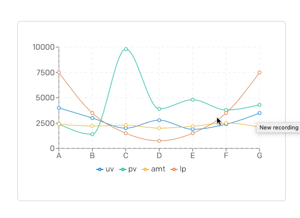
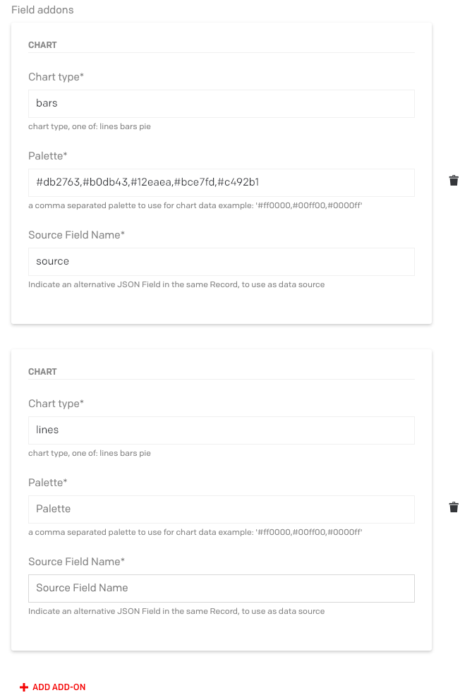
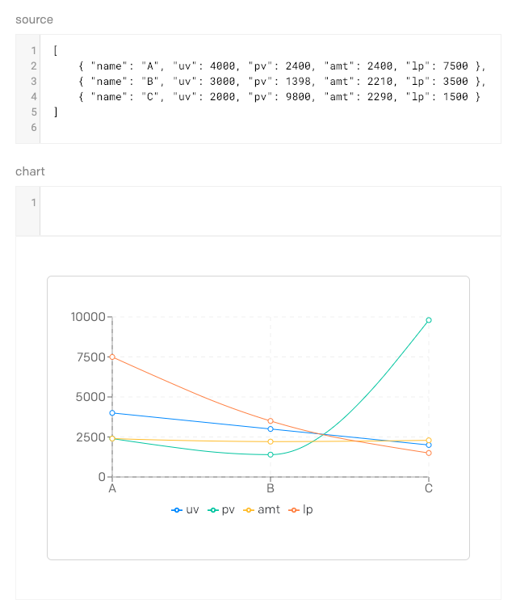
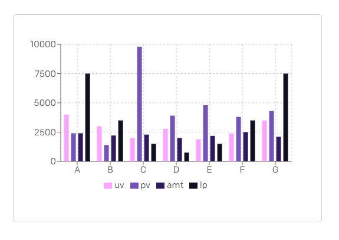
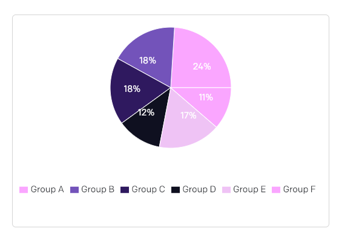

# Chart DatoCMS plugin

Chart from a json field

## Configuration

A chart plugin made with recharts. Works only with JSON Fields



This is the source data for the example image.
The Data must have an attribute "name" to identify the X axis elements
and the other keys are data items related to named points.

```json
[
    { "name": "A", "uv": 4000, "pv": 2400, "amt": 2400, "lp": 7500 },
    { "name": "B", "uv": 3000, "pv": 1398, "amt": 2210, "lp": 3500 },
    { "name": "C", "uv": 2000, "pv": 9800, "amt": 2290, "lp": 1500 },
    { "name": "D", "uv": 2780, "pv": 3908, "amt": 2000, "lp": 750 },
    { "name": "E", "uv": 1890, "pv": 4800, "amt": 2181, "lp": 1500 },
    { "name": "F", "uv": 2390, "pv": 3800, "amt": 2500, "lp": 3500 },
    { "name": "G", "uv": 3490, "pv": 4300, "amt": 2100, "lp": 7500 }
]
```

This plugin is an addon so you could create more chart instance on the same field, 
to change source data, you can specify another json field. The alternative source field must belong to the same record.



in this example we are using a previous json field named "source" as datasource for he chart.



You can personalize  lines bars and pies colors passing a string containing a comma separated color list per intance. 
for example: `'#0088FE,#00C49F,#FFBB28,#FF8042'`


Example of Bars Chart




Expample of Pie Chart


```json
[
  { "name": "Group A", "value": 400 },
  { "name": "Group B", "value": 300 },
  { "name": "Group C", "value": 300 },
  { "name": "Group D", "value": 200 },
  { "name": "Group E", "value": 278 },
  { "name": "Group F", "value": 189 }
]

```




## Development

Install all the project dependencies with:

```
yarn install
```

Add this plugin in development mode to one of your DatoCMS project with:

```
yarn addToProject
```

Start the local development server with:

```
yarn start
```

The plugin will be served from [https://datocms-plugin-chart.localtunnel.me/](https://datocms-plugin-chart.localtunnel.me/). Insert this URL as the plugin [Entry point URL](https://www.datocms.com/docs/plugins/creating-a-new-plugin/).

## Publishing

Before publishing this plugin, make sure:

* you've properly described any configuration parameters in this README file;
* you've properly compiled this project's `package.json` following the [official rules](https://www.datocms.com/docs/plugins/publishing/);
* you've added a cover image (`cover.png`) and a preview GIF (`preview.gif`) into the `docs` folder.

When everything's ready, just run:

```
yarn publish
```
